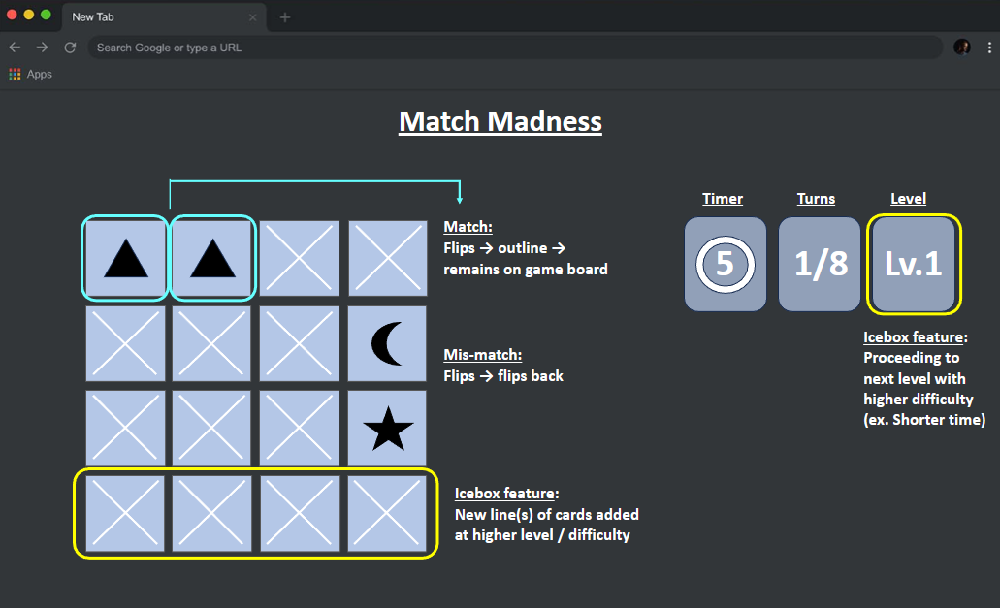

# "Match Madness" 
- The "Match Madness" is a card matching game that tests player's memory and concentration skills as the player flips over cards to find matching pairs. The challenge lies in remembering the positions of the hidden cards and making strategic moves to uncover them before times runs out. Matched pairs will clear from the board, and as player progresses to higher levels, the difficulty increases. 

- FUN FACT : "Concentration" or "Memory" game is considered one of the earliest computer games, and its creation is credited to William Higinbotham, an American physicist and pioneer in the field of computer graphics. Higinbotham developed the memory game in 1958, making it one of the earliest examples of interactive entertainment on a computer!

## I. Wireframes
<!-- Screenshot(s): Images of your actual game. -->

## II. Technologies used 
<!-- List of the technologies used, e.g., JavaScript, HTML, CSS... -->

- HTML, CSS and javascript
- CSS grid and flex box

## III. Key resources 
<!-- resouce links -->

1. [License](./LICENSE.md)
2. [W3docs](https://www.w3docs.com/snippets/javascript/how-to-randomize-shuffle-a-javascript-array.html)

## IV. Getting started

- link to deployed game and any instructions will be updated

## V. Future features
<!-- Planned future enhancements (icebox items) -->
- Add audio
- Further development of icebox features

